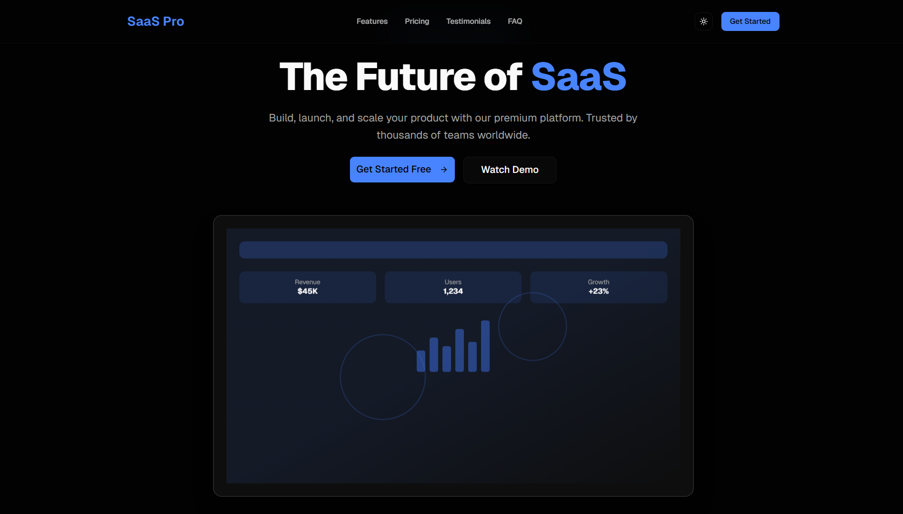
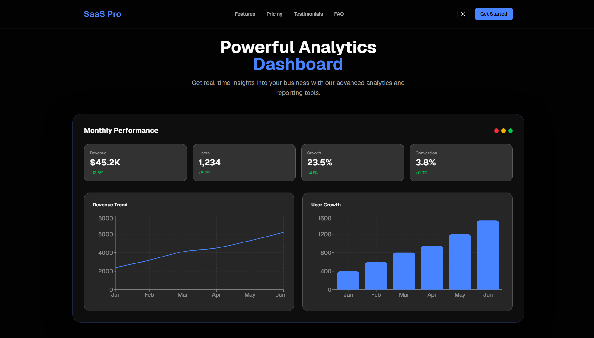
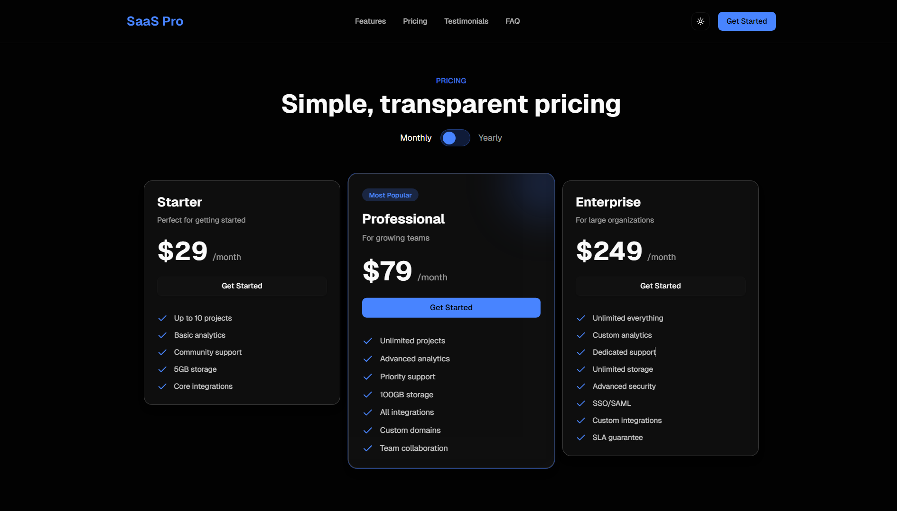

# 🚀 SaaS Pro – Modern SaaS Landing Page Template

A **modern, responsive SaaS landing page template** built with **Next.js, Tailwind CSS, and Framer Motion**.
This template is designed for startups, SaaS products, and developers who want a **clean, premium landing page** to showcase their product.

---

## 🌐 Live Demo

👉 https://saas-landing-page-template-black.vercel.app/

---
## 📸 Preview

### Hero Section


### Dashboard Preview


### Pricing Section


---

## ✨ Features

* ⚡ Built with **Next.js**
* 🎨 Styled using **Tailwind CSS**
* 🎬 Smooth animations using **Framer Motion**
* 📊 Interactive **analytics dashboard preview**
* 💳 Modern **pricing section**
* ⭐ **Testimonials** section
* ❓ **FAQ** section
* 📱 **Fully responsive design**
* 🌙 **Dark modern SaaS UI**
* 🔗 Smooth navigation between sections

---

## 🧱 Tech Stack

* **Next.js**
* **React**
* **Tailwind CSS**
* **Framer Motion**
* **Recharts**
* **TypeScript**

---

## 📂 Project Structure

```
app/
components/
components/sections/
  ├ hero.tsx
  ├ features.tsx
  ├ dashboard-preview.tsx
  ├ pricing.tsx
  ├ testimonials.tsx
  ├ faq.tsx
  ├ cta-section.tsx
  ├ footer.tsx
public/
styles/
```

---

## 🚀 Getting Started

Clone the repository:

```bash
git clone https://github.com/akhilesh2209/saas-landing-page-template.git
```

Install dependencies:

```bash
npm install
```

Run the development server:

```bash
npm run dev
```

Open in browser:

```
http://localhost:3000
```

---

## 📸 Sections Included

This template includes all essential SaaS landing sections:

* Hero section
* Product preview
* Features
* Analytics dashboard preview
* Pricing plans
* Testimonials
* FAQ
* Call to Action
* Footer

---

## 🎯 Use Cases

This template is perfect for:

* SaaS startups
* Product landing pages
* Startup websites
* Developer portfolios
* Template marketplaces

---

## 📄 License

This project is open-source and available under the **MIT License**.

---

## 👨‍💻 Author

Created by **Akhilesh**

If you like this project, feel free to ⭐ the repository.
